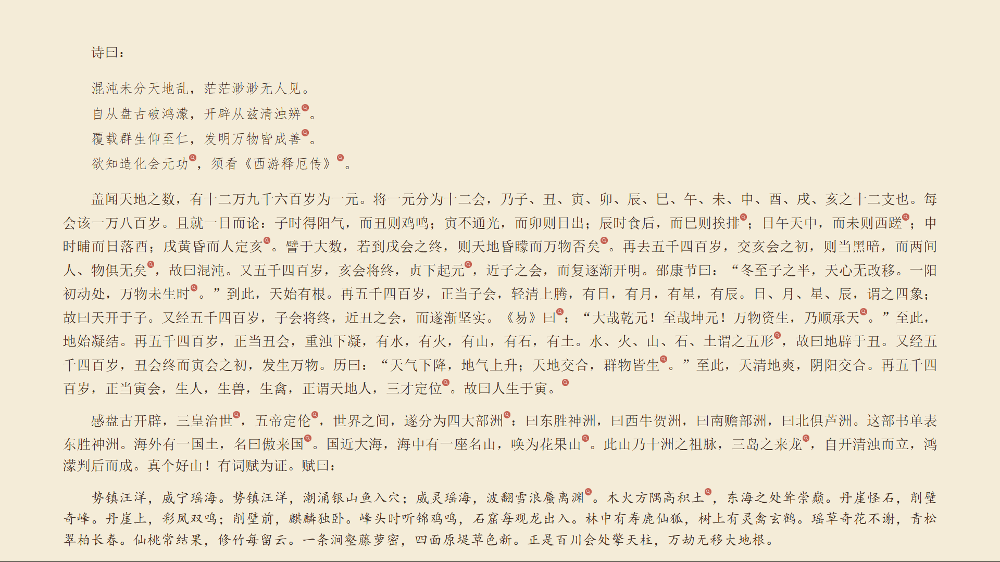
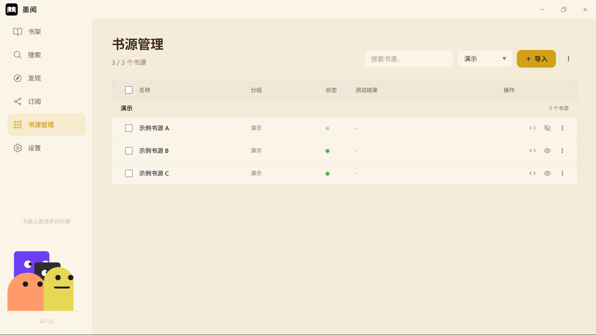

# 墨阅 (AbyssReader)

墨阅是一款跨平台桌面阅读器，兼容 Legado 书源生态，支持小说、漫画、订阅源阅读。

书源 JS 在本地 Deno Core 沙箱中执行，无需 Android 环境即可运行 Legado 书源。

## 为什么是桌面端？

手机阅读 App 已经很成熟，但桌面场景不同：大屏阅读、多窗口对照、与本地 TXT 文件配合。墨阅复刻了 Legado 的书源生态，让你在电脑上也能用熟悉的书源。

## 截图






## 功能

- **书源兼容**：兼容 Legado 书源格式，支持 CSS / XPath / JSONPath / JS / Regex 规则
- **多类型阅读**：文本小说、漫画
- **正文净化**：替换规则、段落重排、简繁转换
- **书架管理**：分组、封面缓存、阅读进度、换源
- **发现页**：分类浏览、无限滚动、筛选条件
- **订阅（RSS）**：订阅源管理、文章阅读、下载导入
- **WebDAV 同步**：备份 / 恢复，密码加密存储
- **调试助手**：搜索 / 目录 / 正文 / JS / WebView / 网络调试

## 快速开始

### 下载安装

从 [Releases](https://github.com/gncysy/AbyssReader/releases) 下载对应平台安装包。

### 从源码构建

前置依赖：

- Node.js 24+
- Rust stable
- Tauri CLI（`cargo install tauri-cli`）
- 系统依赖见 [Tauri 官方文档](https://tauri.app/start/prerequisites/)

```bash
git clone https://github.com/gncysy/AbyssReader.git
cd AbyssReader
npm install
npm run tauri build
```

开发模式：

```bash
npm run dev
```

## 书源兼容性

书源 JS 在本地 Deno Core 沙箱中执行，对齐 Legado 的 Rhino 语义：

- 规则解析：CSS / XPath / JSONPath / JS / Regex
- Java API 桥接：`java.ajax` / `java.base64Encode` / `java.md5Encode` 等
- `Packages.java.*`：BigInteger / MessageDigest / Cipher / GZIPInputStream / Base64 / HashMap / SimpleDateFormat 等

**已知限制**：

- 依赖 Android 系统 API 的书源无法运行
- 部分有强反爬的书源可能因服务端策略失效

## 技术栈

| 层 | 技术 |
|---|---|
| 前端 | Vue 3 + Pinia + Naive UI + TypeScript |
| 引擎 | TypeScript |
| 后端 | Rust + Tauri 2 |
| JS 运行时 | Deno Core + V8 |
| DOM 解析 | scraper（Rust）+ DOMParser（浏览器） |
| 存储 | SQLite + 文件缓存 |
| 网络 | reqwest |

## 架构

```
src/                    # Vue 前端
├── components/         # 通用组件
├── composables/        # 业务逻辑
├── services/           # Tauri invoke 封装 + 引擎注入
├── stores/             # Pinia 状态
├── views/              # 路由页面
├── constants/          # 命名常量
└── types/              # 类型定义

engine/                 # TS 规则引擎
├── parser/             # CSS/XPath/JSONPath/JS/Regex
├── business/           # 搜索/详情/目录/正文/发现
├── url/                # URL 解析
├── crypto/             # 加密
└── network/            # HTTP 接口

src-tauri/              # Rust 后端
├── commands/           # Tauri 命令
├── js_runtime/         # Deno Core 运行时 + polyfills
├── network/            # HTTP
└── storage/            # SQLite + 缓存
```

## 安全

- 书源 JS 在 Deno Core 沙箱中执行
- 内网 IP / localhost / file:// 拦截
- 文件操作限制在缓存目录内
- Cookie 使用 OS 密钥环加密
- WebDAV 密码 AES-GCM 加密

## 开发方式

本项目在开发过程中使用 AI 辅助：

- **需求定义**：由作者负责
- **方案决策**：由作者与 AI 讨论后确定
- **代码生成**：由 AI 完成
- **测试验证**：由作者负责
- **发布维护**：由作者负责

所有架构决策和发布决定都由作者做出。

## 第三方依赖

本项目使用以下开源依赖，感谢它们的作者：

- [@vicons/ionicons5](https://github.com/07akioni/vicons) — MIT License
- [vue](https://github.com/vuejs/core) — MIT License
- [pinia](https://github.com/vuejs/pinia) — MIT License
- [naive-ui](https://github.com/tusen-ai/naive-ui) — MIT License
- [tauri](https://github.com/tauri-apps/tauri) — MIT / Apache-2.0
- [crypto-js](https://github.com/brix/crypto-js) — MIT License
- [gsap](https://github.com/greensock/GSAP) — GreenSock Standard License
- [jszip](https://github.com/Stuk/jszip) — MIT / GPL-3.0
- [dompurify](https://github.com/cure53/DOMPurify) — Apache-2.0 / MPL-2.0

完整依赖列表见 `package.json`。

## 致谢

本项目使用或参考了以下开源项目：

- [Legado](https://github.com/gedoor/legado) — 书源规则体系与解析逻辑参考
- [Tauri](https://tauri.app/) — 跨平台桌面应用框架
- [Vue](https://vuejs.org/) — 前端框架
- [Pinia](https://pinia.vuejs.org/) — 状态管理
- [Naive UI](https://www.naiveui.com/) — UI 组件库
- [Deno Core](https://github.com/denoland/deno_core) — JS 沙箱运行时
- [scraper](https://github.com/causal-agent/scraper) — Rust HTML 解析
- [reqwest](https://github.com/seanmonstar/reqwest) — Rust HTTP 客户端
- [rusqlite](https://github.com/rusqlite/rusqlite) — SQLite Rust 绑定
- [crypto-js](https://github.com/brix/crypto-js) — 前端加密
- [GSAP](https://gsap.com/) — 动画
- [jszip](https://stuk.github.io/jszip/) — ZIP 处理
- [DOMPurify](https://github.com/cure53/DOMPurify) — HTML 净化

感谢所有为开源生态做出贡献的开发者。

## 许可证

GPL-3.0

## 免责声明

墨阅不生产、存储或分发任何书籍内容。所有内容均来自用户自行配置的书源所指向的第三方网站，版权归原作者所有。

部分书源包含 JavaScript 脚本，可发起网络请求、读写本地存储。用户应自行评估所导入脚本的安全性，建议仅从可信来源获取书源。

详见 [src/assets/disclaimer.md](src/assets/disclaimer.md)。